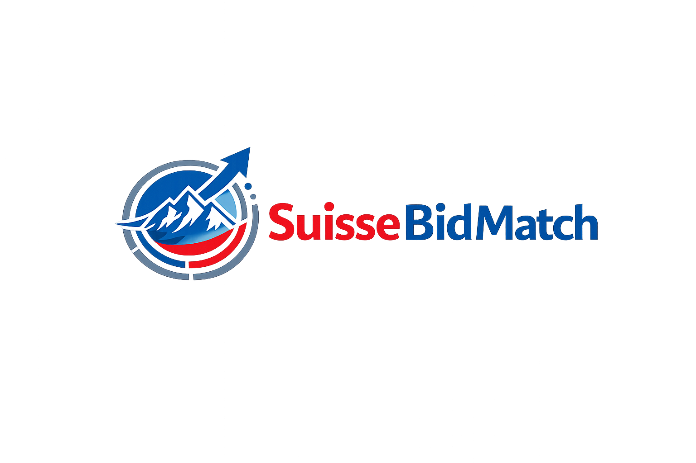
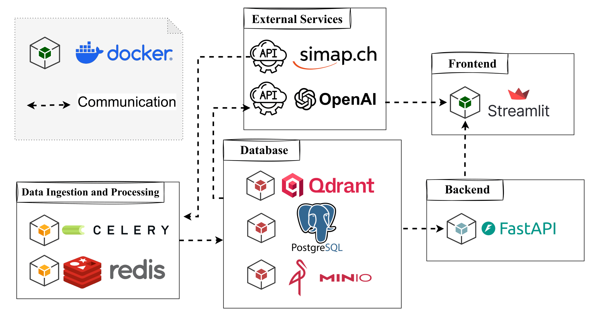

<p align="center">
  
</p>

<p align="center">
  <strong>SuisseBidMatch</strong><br/>
  Spec- & rule-driven tender matching for Swiss public procurement (SIMAP).
</p>

<!-- Tech stack badges -->
<p align="center">
  <a href="https://fastapi.tiangolo.com/">
    
  </a>
  <a href="https://qdrant.tech/documentation/">
    
  </a>
  <a href="https://www.postgresql.org/">
    
  </a>
  <a href="https://docs.celeryq.dev/">
    
  </a>
  <a href="https://redis.io/docs/latest/">
    
  </a>
  <a href="https://docs.min.io/">
    
  </a>
  <a href="https://docs.docker.com/compose/">
    
  </a>
  <a href="https://developers.openai.com/api/docs/guides/embeddings/">
    
  </a>
</p>

> Unofficial project — not affiliated with simap.ch or Swiss authorities.

## What it does
Turn your internal **product specs, capabilities, and business rules** into:
- a ranked list of best-fit SIMAP tenders
- explainable match reasons (why it fits / why it doesn’t)

## Architecture
<p align="center">
  
</p>

## Quickstart
```bash
# placeholder