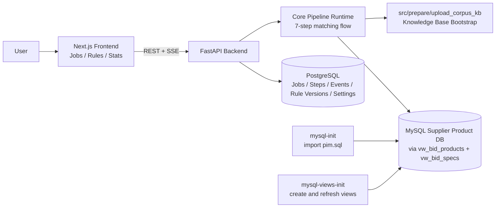

<p align="center">
  
</p>

<h1 align="center">Heidi Tender</h1>

<p align="center">
  <strong>AI-native tender intelligence for procurement teams that need faster decisions, tighter rigor, and explainable supplier matches.</strong>
</p>

<p align="center">
  
  
  
</p>

<p align="center">
  Heidi Tender transforms dense tender packs into ranked, defensible product recommendations by combining document understanding, governed rules, SQL-backed filtering, and explainable AI scoring.
</p>

## Why Heidi Tender

Procurement teams spend too much time buried in PDFs, spreadsheets, supplier data, and compliance checks. Heidi Tender brings that work into one auditable flow: extract what matters, apply hard constraints, rank the best candidates, and keep the reasoning visible from start to finish.

<table>
  <tr>
    <td width="33%" valign="top">
      <strong>Structured from messy inputs</strong><br />
      Upload tender files, archives, and technical documents, then convert unstructured material into a consistent requirement pipeline.
    </td>
    <td width="33%" valign="top">
      <strong>Governed matching logic</strong><br />
      Blend LLM extraction, explicit business rules, and SQL execution against supplier catalog data instead of relying on vague keyword search.
    </td>
    <td width="33%" valign="top">
      <strong>Explainable outcomes</strong><br />
      Produce shortlist-ready candidates with traceable evidence, fit logic, and operational visibility for more confident bid decisions.
    </td>
  </tr>
</table>

## What The Platform Does

- Ingests tender packs and supporting files through a web workflow
- Extracts requirements and procurement signals from unstructured documents
- Applies field rules and hard-versus-soft constraint logic
- Generates SQL from validated hard requirements and executes it on supplier product views
- Ranks surviving candidates using soft constraints and model-assisted reasoning
- Streams job progress, step status, and system events in real time

## Core Product Highlights

- **7-step pipeline with explicit contracts** across extraction, merge, SQL generation, execution, and ranking
- **Rule Copilot with human approval** so generated rule drafts can be reviewed before publication
- **Snapshot-based rule binding** to keep running jobs stable even when rules evolve later
- **Realtime telemetry** through SSE events with polling-friendly frontend behavior
- **Docker-first deployment** with app services, MySQL catalog bootstrap, and knowledge-base initialization

## Architecture



## How Matching Works

1. Knowledge-base bootstrap and vector store readiness check
2. Requirement extraction from tender files
3. External field rule determination
4. Requirement merge with hardness classification
5. SQL generation from hard constraints
6. SQL execution against supplier product views
7. Candidate ranking using soft constraints

## Stack

- `Next.js` frontend for job orchestration, rule management, and monitoring
- `FastAPI` backend for APIs, execution control, and streaming events
- `PostgreSQL` for application state and versioned rule metadata
- `MySQL` for supplier product data and SQL-backed candidate filtering
- OpenAI models for extraction, reasoning, and ranking stages

## Quickstart

### Prerequisites

- Docker and Docker Compose v2
- OpenAI API key

### Configure

Create a root `.env` file with at least:

```bash
OPENAI_API_KEY=your_key_here
OPENAI_MODEL=gpt-5-mini
```

### Run

```bash
docker compose up --build
```

### Endpoints

- Frontend: `http://localhost:3000`
- Backend API: `http://localhost:8000/api/v1`
- Health check: `http://localhost:8000/health`

## Startup Sequence

1. `mysql` starts and prepares the supplier product database
2. `mysql-init` imports `src/prepare/pim.sql` when initialization is needed
3. `mysql-views-init` creates or refreshes `vw_bid_products` and `vw_bid_specs`
4. `backend` starts after data services are ready
5. `frontend` starts and connects to the API

## Operating Model

### Job lifecycle

`created -> uploading -> ready -> running -> succeeded | failed`

### Realtime monitoring

- `GET /api/v1/jobs/{job_id}/events` streams step and lifecycle events over SSE
- Incremental event IDs support reconnect flows via `Last-Event-ID`
- Frontend behavior tolerates disconnects and can fall back to polling

## API Surface

### Jobs

- `POST /api/v1/jobs`
- `GET /api/v1/jobs`
- `POST /api/v1/jobs/{job_id}/file`
- `POST /api/v1/jobs/{job_id}/archive`
- `POST /api/v1/jobs/{job_id}/start`
- `GET /api/v1/jobs/{job_id}`
- `GET /api/v1/jobs/{job_id}/result`

### Rules

- `GET /api/v1/rules/current`
- `GET /api/v1/rules/versions`
- `POST /api/v1/rules/draft`
- `POST /api/v1/rules/generate`
- `POST /api/v1/rules/generate/stream`
- `POST /api/v1/rules/{version_id}/publish`

### Settings and stats

- `GET /api/v1/settings/model`
- `PUT /api/v1/settings/model`
- `GET /api/v1/stats/dashboard`

## Local Development

### Backend

```bash
cd src/web/backend
python3 -m venv .venv
source .venv/bin/activate
pip install -r requirements.txt -r ../../requirements.txt
uvicorn app.main:app --reload --host 0.0.0.0 --port 8000
```

### Frontend

```bash
cd src/web/frontend
npm install
npm run dev
```

## Testing

```bash
python3 -m pytest tests src/web/backend/tests
```

## Notes

- This project currently focuses on Swiss tender workflows and lighting product matching
- The platform is independent and not affiliated with `simap.ch`

[](./LICENSE)
